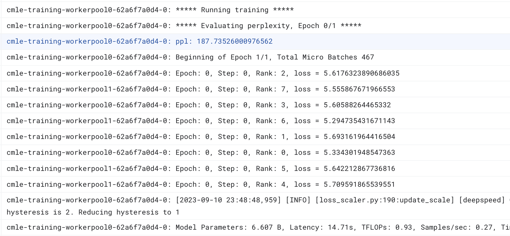
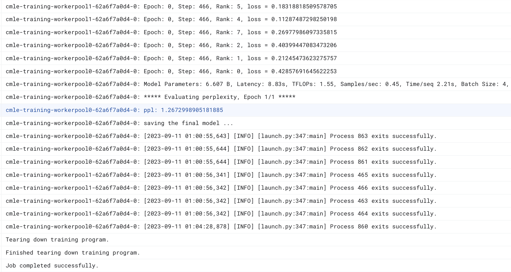
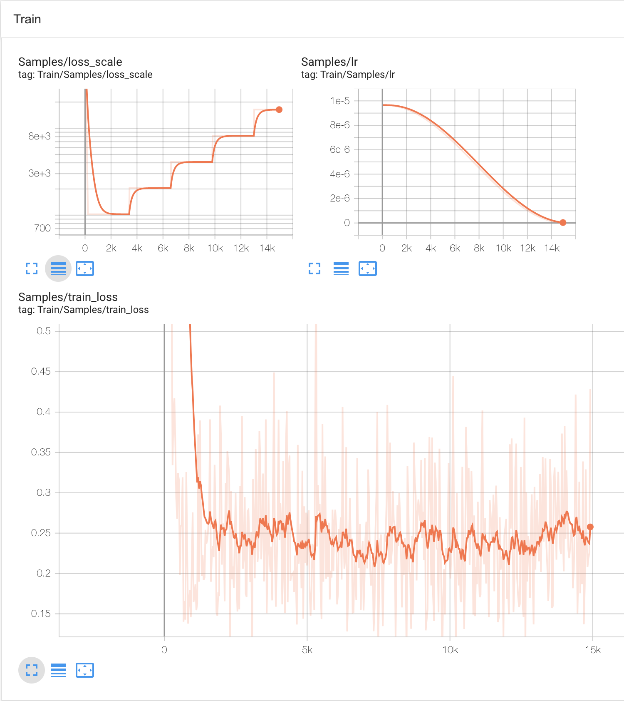

# Fine Tuning ChatGPT-like Models

DeepSpeed introduced a general system framework for enabling an end-to-end training experience for ChatGPT-like models, named [DeepSpeed-Chat](https://github.com/microsoft/DeepSpeedExamples/tree/master/applications/DeepSpeed-Chat).

As a test to the Vertex-DeepSpeed container, this is a functional example executing a single supervised fine tuning epoch with [OPT-125m](https://huggingface.co/facebook/opt-125m), hosted on HuggingFace. The training code is adopted from DeepSpeed-Chat's [Step-1 Supervised Fine Tuning](https://github.com/microsoft/DeepSpeedExamples/tree/master/applications/DeepSpeed-Chat/training/step1_supervised_finetuning). 


## What you should expect

As a test, with 2 n1-standard-4 nodes each with 1 T4, it takes 5-10 minutes to run 10% of the training data against `facebook/opt-125m`, with a batch size between 8-32. The training code includes a pre and post perplexity evaluation:

At the beginning of the run:

<div align="center">
   
</div>

At the end of the run:

<div align="center">
  
</div>

Its TensorBoard:

<div align="center">
  
</div>

## Llama-2 Models

The DeepSpeed-Chat code supports Llama-2-xxb-hf versions of the Llama-2 models from HuggingFace. To try models such as `meta-llama/Llama-2-7b-hf`:
1. Get approval from Meta
2. Get approval from HuggingFace
3. Create a read token from your [HF account](https://huggingface.co/settings/tokens)
4. Put the token content into a file e.g. `token`
5. Uncomment the COPY token ... line in the dockerfile to include it in the container.

See the recent [improvement update](https://github.com/microsoft/DeepSpeed/blob/master/blogs/deepspeed-chat/ds-chat-release-8-31/README.md) from DeepSpeed-Chat on Llama-2 support.


A test run with `meta-llama/Llama-2-7b-hf`:

* 2x a2-highgpu-4g, each has 4 A10040GBs. 
* Took 1.5 hrs running 50% of the `Dahoas/synthetic-instruct-gptj-pairwise` dataset:
* Batch size 4, Zero Stage 3, Offload disabled.

At the beginning of the run:

<div align="center">
   
</div>

At the end of the run:

<div align="center">
  
</div>

Its TensorBoard:

<div align="center">
  
</div>


# Set up

## Bringing over training code from DeepSpeed-Chat

The example illustrating how to use the Vertex DeepSpeed container with [DeepSpeed-Chat](https://github.com/microsoft/DeepSpeedExamples/tree/master/applications/DeepSpeed-Chat) requires bringing over some code from [Step-1 Supervised Fine Tuning](https://github.com/microsoft/DeepSpeedExamples/tree/master/applications/DeepSpeed-Chat/training/step1_supervised_finetuning). 

The deepspeed-chat.Dockerfile relies on the following being in the correct path to build: `main.py` and `utils`. To download the code:

```sh
git clone https://github.com/microsoft/DeepSpeedExamples.git
```

Given the relative location of this repo `./vertex-deepspeed`, copy the following over into the third_party directory:

```sh
cp -R DeepSpeedExamples/applications/DeepSpeed-Chat/training/utils ./vertex-deepspeed/third_party/deepspeed_examples/
```

```sh
cp DeepSpeedExamples/applications/DeepSpeed-Chat/training/step1_supervised_finetuning/main.py ./vertex-deepspeed/third_party/deepspeed_examples/
```

The deepspeed_examples directory should look like:
```sh
$ ls -l ./vertex-deepspeed/third_party/deepspeed_examples/
total 32
-rwxr-xr-x  1 user  group  13909 Sep  9 15:09 main.py
drwxr-xr-x  9 user  group    288 Sep  9 14:47 utils
```

You are ready to try the [example](../../examples/deepspeed-chat/Vertex_DeepspeedChat.ipynb)

